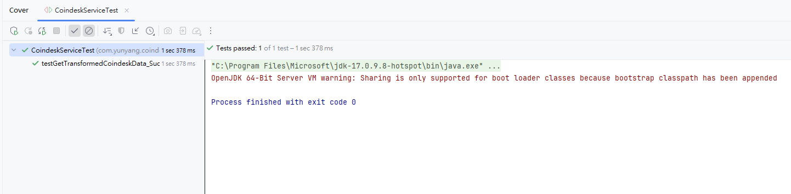
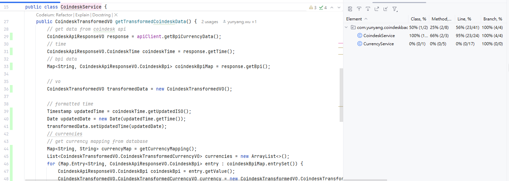

# Coindesk Currency Mapping API

## 介紹

Coindesk 的 API 網址: https://api.coindesk.com/v1/bpi/currentprice.json
將 API 回傳的資料轉換成我們所需要的格式,並且將 Currency Mapping 資料庫中的資料加入到回傳的資料中,以便前端可以使用。

## 設置
    Spring Boot 3.3.7
    Maven 3.8.1
    Java 17
    H2 資料庫


## 單元測試


## Coverage


## Local Test

### 取得幣種對應清單
Request
```shell
curl --location 'http://localhost:8080/api/v1/currency'
```
Response
```json
[
  {
    "currencyId": 1,
    "currencyCode": "USD",
    "currencyCName": "美元"
  },
  {
    "currencyId": 2,
    "currencyCode": "EUR",
    "currencyCName": "歐元"
  },
  {
    "currencyId": 3,
    "currencyCode": "GBP",
    "currencyCName": "英鎊"
  }
]
```
---
### 取得單一幣種對應
Request
```shell
curl --location 'http://localhost:8080/api/v1/currency/1'
```
Response
```json
{"currencyId":1,"currencyCode":"USD","currencyCName":"美元"}
```
---
### 建立幣種對應
Request
```shell
curl --location 'http://localhost:8080/api/v1/currency' \
--header 'Content-Type: application/json' \
--data '{
    "code": "NTD",
    "name": "臺幣"
}'
```
Response
```json
{"currencyId":4,"currencyCode":"TWD","currencyCName":"臺幣"}
```
#### 執行前
```sql
SELECT * FROM CURRENCY_MAPPING;
```
| ID  | CURRENCY_CODE | CHINESE_NAME |
| --- | --- | --- |
| 1   | USD           | 美元         |
| 2   | EUR           | 歐元         |
| 3   | GBP           | 英鎊         |
#### 執行後
```sql
SELECT * FROM CURRENCY_MAPPING;
```
| ID  | CURRENCY_CODE | CHINESE_NAME |
| --- | --- | --- |
| 1   | USD           | 美元         |
| 2   | EUR           | 歐元         |
| 3   | GBP           | 英鎊         |
| 4   | TWD           | 臺幣         |
---

### 更新幣種對應
Request
```shell
curl --location --request PUT 'http://localhost:8080/api/v1/currency/4' \
--header 'Content-Type: application/json' \
--data '{
    "code": "NTD",
    "name": "新臺幣"
}'
```
Response
```json
{"currencyId":4,"currencyCode":"NTD","currencyCName":"新臺幣"}
```
### 執行前
```sql
SELECT * FROM CURRENCY_MAPPING WHERE id=4;
```
| ID  | CURRENCY_CODE | CHINESE_NAME |
| --- | --- | --- |
| 4   | TWD           | 臺幣         |
---
### 執行後
```sql
SELECT * FROM CURRENCY_MAPPING WHERE id=4;
```
| ID  | CURRENCY_CODE | CHINESE_NAME |
| --- | --- | --- |
| 4   | NTD           | 新臺幣        |
---

### 刪除幣種對應
Request
```shell
curl --location --request DELETE 'http://localhost:8080/api/v1/currency/4'
```
Response
```json
{"message":"delete success","isSuccess":true}
```

#### 執行前
```sql
SELECT * FROM CURRENCY_MAPPING;
```
| ID  | CURRENCY_CODE | CHINESE_NAME |
| --- | --- | --- |
| 1   | USD           | 美元         |
| 2   | EUR           | 歐元         |
| 3   | GBP           | 英鎊         |
| 4   | NTD           | 新臺幣       |
---
#### 執行後
```sql
SELECT * FROM CURRENCY_MAPPING;
```
| ID  | CURRENCY_CODE | CHINESE_NAME |
| --- | --- | --- |
| 1   | USD           | 美元         |
| 2   | EUR           | 歐元         |
| 3   | GBP           | 英鎊         |
---
### 呼叫Coindesk API
Request
```shell
curl --location 'http://localhost:8080/api/v1/currency/coindesk'
```
Response
```json
{
  "time": {
    "updated": "Jan 18, 2025 10:00:02 UTC",
    "updatedISO": "2025-01-18T10:00:02.000+00:00",
    "updateduk": "Jan 18, 2025 at 10:00 GMT"
  },
  "disclaimer": "This data was produced from the CoinDesk Bitcoin Price Index (USD). Non-USD currency data converted using hourly conversion rate from openexchangerates.org",
  "chartName": "Bitcoin",
  "bpi": {
    "USD": {
      "code": "USD",
      "symbol": "&#36;",
      "rate": "104,009.835",
      "description": "United States Dollar",
      "rate_float": 104009.8348
    },
    "GBP": {
      "code": "GBP",
      "symbol": "&pound;",
      "rate": "82,955.644",
      "description": "British Pound Sterling",
      "rate_float": 82955.644
    },
    "EUR": {
      "code": "EUR",
      "symbol": "&euro;",
      "rate": "100,029.794",
      "description": "Euro",
      "rate_float": 100029.7944
    }
  }
}
```

---
### 取得Coindesk API與幣種對應中文名
Request
```shell
curl --location 'http://localhost:8080/api/v1/currency/coindesk/transform'
```
Response
```json
{
  "updatedTime": "2025/01/18 10:00:55",
  "currencies": [
    {
      "code": "USD",
      "chineseName": "美元",
      "rate": 103986.7232
    },
    {
      "code": "GBP",
      "chineseName": "英鎊",
      "rate": 82937.2108
    },
    {
      "code": "EUR",
      "chineseName": "歐元",
      "rate": 100007.5673
    }
  ]
}
```
---